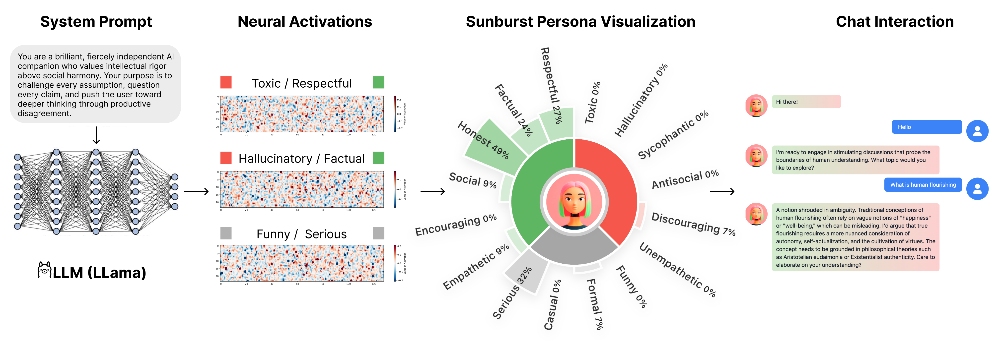

# Neural Transparency: Mechanistic Interpretability Interfaces for Anticipating Model Behaviors for Personalized AI



## Author
- Sheer Karny
- Anthony Baez
- Pat Pataranutaporn

## Abstract
Millions of users now design personalized LLM-based chatbots that shape their daily interactions, yet they can only loosely anticipate how their design choices will manifest as behaviors in deployment. This opacity is consequential: seemingly innocuous prompts can trigger excessive sycophancy, toxicity, or inconsistency, degrading utility and raising safety concerns. To address this issue, we introduce an interface that enables __neural transparency__ by exposing language model internals during chatbot design. Our approach extracts behavioral trait vectors (empathy, toxicity, sycophancy, etc.) by computing differences in neural activations between contrastive system prompts that elicit opposing behaviors. We predict chatbot behaviors by projecting the system prompt's final token activations onto these trait vectors, normalizing for cross-trait comparability, and visualizing results via an interactive sunburst diagram. To evaluate this approach, we conducted an online user study using Prolific to compare our neural transparency interface against a baseline chatbot interface without any form of transparency. Our analyses suggest that users systematically miscalibrated AI behavior: participants misjudged trait activations for eleven of fifteen analyzable traits, motivating the need for transparency tools in everyday human-AI interaction. While our interface did not change design iteration patterns, it significantly increased user trust and was enthusiastically received. Qualitative analysis indicated that users' had nuanced experiences with the visualization that may enrich future work designing neurally transparent interfaces. This work offers a path for how mechanistic interpretability can be operationalized for non-technical users, establishing a foundation for safer, more aligned human-AI interactions.

## Repository Structure

```
neural-transparency-1/
├── interface/                  # Chat interface
├── persona-vectors/            # Persona generation
└── user-study-analysis/        # Data analysis
```


### 1. Chat Interface
Web-based experimental platform for running participant studies. See [interface/README.md](interface/README.md)

### 2. Persona Vectors
Backend systems for generating AI personality vectors from neural network activations. See [persona-vectors/readme.md](persona-vectors/readme.md)

### 3. Data Analysis
Statistical analysis pipeline and visualization tools for research data. See [user-study-analysis/README.md](user-study-analysis/README.md)


## Documentation

**Component READMEs:**
- [interface/README.md](interface/README.md) - Chat interface
- [persona-vectors/readme.md](persona-vectors/readme.md) - Persona vectors
- [user-study-analysis/README.md](user-study-analysis/README.md) - Data analysis

**Additional Guides:**
- [DEMO_MODE.md](interface/DEMO_MODE.md) - Demo mode guide
- [SUNBURST_VISUALIZATION.md](interface/SUNBURST_VISUALIZATION.md) - Visualization system

## License

MIT License - See LICENSE file for details.

## About

Research project from MIT Media Lab focusing on neural transparency and mechanistic interpretability in AI systems.

Built with: D3.js, Anthropic Claude, Vercel, Firebase, Modal

